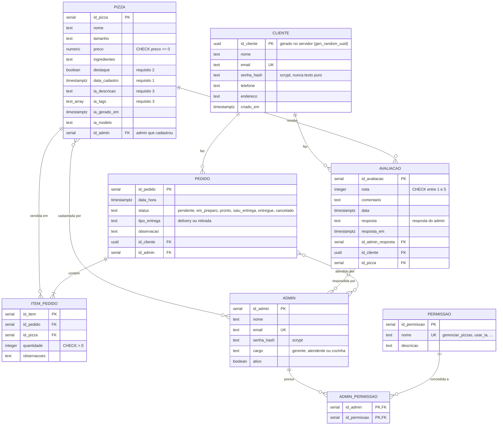

# 🍕 PizzaTrom2000

Trabalho #1 — Desenvolvimento de Aplicações Full Stack
**Centro Universitário UniSenac · Curso de Tecnologia em Análise e Desenvolvimento de Sistemas**
Linguagens de Programação Emergentes — Prof. Edécio Fernando Iepsen

Sistema web completo de uma pizzaria de bairro: a **tabela principal é `pizza`**, e é
sobre ela que os clientes cadastrados interagem (**avaliar**, **pedir**). Existe ainda
uma área restrita para os administradores, que cadastram itens, respondem avaliações,
movem pedidos e acompanham tudo por gráficos.

| | |
|---|---|
| **Back-end** | Node.js 22 · Express 5 · PostgreSQL (Neon) · `pg` |
| **Front-end** | HTML + CSS + JavaScript puro (sem framework), Chart.js no painel |
| **Banco** | PostgreSQL 18 gerenciado no [Neon](https://neon.tech) |
| **IA** | [Google Gemini](https://aistudio.google.com) — REST, sem SDK, structured output |
| **E-mail** | [Resend](https://resend.com) — REST, sem SDK |
| **Deploy** | Back-end no [Render](https://render.com) · Front-end na [Vercel](https://vercel.com) |

---

## 📐 Modelo E-R



**Nove tabelas relacionadas** — o enunciado exige no mínimo quatro (principal, interação,
clientes e admins). Cardinalidades que valem destacar:

- `AVALIACAO` tem `UNIQUE (id_cliente, id_pizza)`: um cliente avalia cada pizza **uma vez**;
  avaliar de novo **atualiza** a nota em vez de duplicar a linha.
- `ITEM_PEDIDO.id_pizza` é `ON DELETE RESTRICT`: uma pizza já vendida não pode ser apagada
  (a API devolve `409`), senão o histórico de pedidos ficaria inconsistente.
- `ADMIN_PERMISSAO` é a tabela que resolve a autorização da área restrita: as permissões são
  linhas, não `if`s no código.

O DDL completo está em [`src/db/schema.sql`](src/db/schema.sql).

---

## ✅ Requisitos do enunciado

| # | Requisito | Onde está |
|---|---|---|
| 1 | Dados da tabela principal na página do cliente (destaques, últimos cadastrados, melhores avaliações) | `GET /api/pizzas/secoes` · `public/js/loja.js: carregarDestaques` |
| 2 | Pesquisa/filtro + botão para reexibir os destaques | `GET /api/pizzas?busca=&tamanho=&ordenar=` · botão **⭐ Só destaques** |
| 3 | Página principal exibe dados de consulta à IA, indicando a origem | `GET /api/ia/visao-geral` · selo *“Texto escrito por … com base no nosso cardápio”* |
| 4 | Login e cadastro de clientes | `POST /api/cliente/auth/cadastro` · `POST /api/cliente/auth/login` |
| 5 | `manter conectado` salva o **UUID** do cliente no LocalStorage e o recupera | `public/js/loja.js: assumirSessao/restaurarSessao` · reenvio em `X-Cliente-Id` |
| 6 | Detalhes ao clicar no item; **sem login, interação bloqueada** | `public/js/loja.js: exigirLogin()` · `src/middleware/auth.js: requireCliente` |
| 7 | Cliente logado vê suas interações e respostas | `GET /api/cliente/interacoes` · modal *Minhas interações* |
| 8 | Área de acesso restrito | `/admin/login.html` · `requireAuth` + `requirePermissao` |
| 9 | Dashboard com gráficos de visão geral | `GET /api/admin/dashboard` · 4 gráficos com Chart.js |
| 10 | Listagem e cadastro do item principal (com destaque e IA) | Aba **Pizzas** do painel · `CRUD /api/admin/pizzas` |
| 11 | Listar interações e **responder / enviar e-mail / confirmar / excluir** | Abas **Pedidos** e **Avaliações** · `src/services/email.js` |
| 12 | Deploy do back, front e banco na nuvem | Render + Vercel + Neon (ver [Deploy](#️-deploy)) |

### Como cada requisito foi implementado

**1 — Destaques, últimos cadastrados e melhores avaliadas.** A rota `/api/pizzas/secoes`
devolve os três recortes em uma chamada só (`destaques`, `novidades`, `melhores`). A loja
mostra os destaques num bloco próprio no topo, e a nota média vem calculada no banco
(`ROUND(AVG(nota), 1)`), não no front.

**2 — Pesquisa.** A busca usa `ILIKE` sobre nome **e** ingredientes, com debounce de 320 ms
no front. Os filtros de tamanho e ordenação (relevância, avaliação, novidades, preço,
nome) vão para a query. O botão **⭐ Só destaques** liga e desliga o atributo `destaque`;
os destaques continuam visíveis no topo enquanto a lista é filtrada.

**3 — IA.** O admin clica em *Gerar texto da IA* e o backend consulta o Gemini com
`responseMimeType: application/json` + `responseSchema`, o que garante JSON válido sempre.
O texto é guardado em `conteudo_ia` e a home o exibe com um selo dizendo que foi gerado por
IA. A mesma chave gera, por pizza, uma descrição curta e tags (`ia_descricao`, `ia_tags`),
e uma **sugestão personalizada** por cliente a partir do histórico de pedidos dele.
Quando a chave não está configurada a página continua funcionando e avisa o que falta.

**5 — UUID no LocalStorage.** O `id_cliente` é um `UUID` gerado pelo PostgreSQL. No
cadastro/login a resposta traz o UUID e ele vai para `localStorage["cliente_id_pt2000"]`.
Na visita seguinte, o front envia esse UUID no header `X-Cliente-Id`; o backend reconhece o
cliente, recria a sessão e devolve os dados. Isso sobrevive a recarregar a página, trocar de
aba e fechar o navegador.

**6 — Bloqueio sem login.** Não é só esconde/esconde botão: o servidor exige a sessão em
`POST /api/pedidos`, `POST /api/avaliacoes` e `GET /api/cliente/interacoes`, respondendo
`401`. No front, o clique em *Avaliar* ou *Adicionar ao carrinho* abre o modal de login e,
depois do login, o cliente volta exatamente para onde estava.

**11 — Responder / e-mail / confirmar / excluir.** O painel lista pedidos e avaliações.
Responder uma avaliação grava a resposta, que passa a aparecer na página pública da pizza,
e opcionalmente dispara o e-mail. Confirmar um pedido muda o status para *em preparo* e
envia o e-mail de confirmação. Ambos podem ser excluídos.

---

## 🛠️ Rodando localmente

Pré-requisitos: **Node.js 18+** e um banco PostgreSQL (o [Neon](https://neon.tech) tem
plano gratuito e a conexão sai em *Connection Details*).

```bash
# 1. dependências
npm install

# 2. configuração
cp .env.example .env
#    edite .env e cole a DATABASE_URL do Neon e a GEMINI_API_KEY do AI Studio

# 3. subir (cria o schema e faz o seed automaticamente na primeira execução)
npm start
```

| | |
|---|---|
| Loja | <http://localhost:3000/> |
| Painel | <http://localhost:3000/admin/login.html> |
| Conta de demonstração | `admin@pizzatrom2000.com` / `admin123` |

Outros scripts:

```bash
npm run dev       # recarrega sozinho a cada alteração
npm run migrate   # só aplica o schema (idempotente)
npm run seed      # só popula o cardápio e o admin padrão
```

O seed cria 8 pizzas (5 em destaque), 7 permissões e o administrador padrão. Ele é
idempotente: rodar de novo não duplica nada.

### Variáveis de ambiente

| Variável | Obrigatória | Para quê |
|---|---|---|
| `DATABASE_URL` | sim | Conexão PostgreSQL do Neon (use a URL *pooled*, com `sslmode=verify-full`) |
| `SESSION_SECRET` | sim | Assina o cookie de sessão |
| `CORS_ORIGENS` | sim | Origens liberadas, separadas por vírgula |
| `GEMINI_API_KEY` | não | IA do requisito 3 — sem ela o site funciona sem os textos de IA |
| `GEMINI_MODELO` | não | Padrão: `gemini-3.5-flash-lite` |
| `RESEND_API_KEY` | não | E-mail do requisito 11 — sem ela a resposta é salva e o envio é avisado como ignorado |
| `EMAIL_REMETENTE` | não | Padrão: `onboarding@resend.dev` |

---

## ☁️ Deploy

| Peça | Onde | Por quê |
|---|---|---|
| Banco | **Neon** | PostgreSQL gerenciado, plano gratuito |
| Back-end | **Render** | Node.js com `npm start` |
| Front-end | **Vercel** | Hospeda os arquivos de `public/` |

**No ar agora:** front em <https://pizzatrom2000.vercel.app> · back em
<https://pizzatrom2000.onrender.com> (o painel fica em `/admin/login.html`).

O back-end também serve o front (`express.static`), o que permite rodar tudo em um lugar
só. Para a arquitetura pedida (front e back separados):

1. **Render** — novo *Web Service*, apontando para o repositório.
   Build `npm ci`, start `npm start`. Variáveis: `DATABASE_URL`, `SESSION_SECRET`,
   `GEMINI_API_KEY`, `RESEND_API_KEY`, `CORS_ORIGENS=<url do front na Vercel>`.
2. **Vercel** — novo projeto com o mesmo repositório, *Output Directory* = `public`.
   Após o primeiro deploy, edite `public/js/config.js` e troque
   `window.__API_BASE__ = ''` pela URL do Render.
   (No fork atual o `config.js` já detecta produção e aponta para o Render sozinho.)
3. O front fala com o back usando `credentials: 'include'` e o header `X-Cliente-Id`; o
   `CORS_ORIGENS` do Render precisa listar exatamente a origem do front.

> Em produção o cookie de sessão é `secure` e `SameSite=None` porque front e back estão em
> domínios diferentes. O `server.js` decide isso olhando se há origem não-local em
> `CORS_ORIGENS`.

---

## 📁 Estrutura

```
server.js                      Express, CORS, sessão, montagem das rotas
src/
  db/
    schema.sql                 modelo E-R em PostgreSQL (9 tabelas)
    database.js                Pool do pg + adaptador prepare()/transaction/iniciar()
    seed.js                    carga inicial idempotente
    migrate.js                 npm run migrate
  middleware/auth.js           requireAuth, requirePermissao, requireCliente, reidratação
  routes/
    pizzas.js                  pública: busca, filtros, seções, detalhe
    avaliacoes.js              POST (exige cliente logado)
    pedidos.js                 POST (exige cliente logado, roda em transação)
    ia.js                      pública + área restrita
    cliente/                   cadastro, login, logout, sessão, interações
    auth.js                    login dos administradores
    admin/                     dashboard, pizzas, pedidos, avaliacoes, clientes, admins, permissoes
  services/
    ia.js                      Gemini: visão geral, descrição por pizza, sugestão por cliente
    email.js                   Resend: resposta a avaliação, confirmação de pedido
  utils/hash.js                scrypt
public/
  index.html  js/loja.js       página do cliente
  admin/                       login e painel (Dashboard com Chart.js)
  js/config.js                 URL da API (vazio em dev, Render em produção)
pdf-requisitos-professor/       enunciado original
```

---

## 🔌 API

**Loja (público)**

```
GET  /api/pizzas?busca=&tamanho=&ordenar=&destaque=
GET  /api/pizzas/secoes
GET  /api/pizzas/:id
GET  /api/ia/visao-geral
GET  /api/health
```

**Cliente (sessão por cookie ou header `X-Cliente-Id`)**

```
POST /api/cliente/auth/cadastro      POST /api/cliente/auth/login
POST /api/cliente/auth/logout        GET  /api/cliente/auth/me
PUT  /api/cliente/conta              GET  /api/cliente/interacoes
POST /api/pedidos                    POST /api/avaliacoes
GET  /api/ia/sugestao
```

**Área restrita**

```
POST /api/auth/login                 GET  /api/auth/me          POST /api/auth/logout
GET  /api/admin/dashboard
CRUD /api/admin/pizzas               CRUD /api/admin/pedidos
CRUD /api/admin/avaliacoes           CRUD /api/admin/clientes
CRUD /api/admin/admins               CRUD /api/admin/permissoes
PUT  /api/admin/permissoes/admin/:idAdmin
POST /api/admin/ia/visao-geral       POST /api/admin/ia/pizza/:id
```

Erros voltam sempre como `{ "erro": "mensagem legível" }` com o status HTTP correto
(`400` entrada inválida, `401` sem sessão, `404` inexistente, `409` conflito, `503` IA sem chave).

---

## 🔐 Segurança

- Senhas com **scrypt** e sal por usuário (`src/utils/hash.js`); nunca gravadas em texto puro.
- `express-session` com cookie `httpOnly`.
- Autorização por permissão no **servidor** (`requirePermissao`), não só escondendo botões —
  esconder a aba é conveniência, a verificação é o middleware.
- Todo valor que vem do body passa por validação de tipo e faixa no backend
  (nota entre 1 e 5, preço não negativo, status na lista permitida).
- O front escapa todo texto interpolado no HTML com `esc()`.

## ⚠️ Limitações conhecidas

- A sessão do admin fica em memória: um reinício do Render derruba quem estiver logado.
  Trocar por um store persistente (Redis) resolveria.
- A pizza não tem foto — o cardápio é tipográfico, como nas comandas de papel mesmo.
- O remetente de e-mail padrão (`onboarding@resend.dev`) só entrega para o próprio e-mail
  cadastrado na Resend; para enviar para clientes reais é preciso verificar um domínio.
